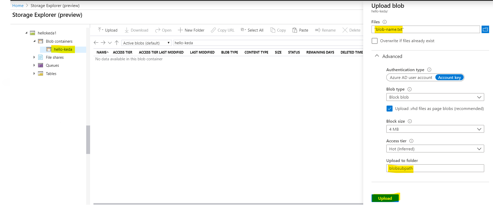

# Azure Function (.NET Core) consuming Blobs scaled by KEDA
Following sample includes an Azure function in .Net core that triggers when new blobs added to Azure Blob Storage and scale via KEDA. 

The sample blob consumer will recive a single blob at a time(per instance), and write the blob name and size into the log to simulate performing work then delete the blob from the container. When adding blobs, KEDA will drive the container to scale out according to the count of the blobs in given container.

# Pre-requisites
* Docker installed
* Azure Function Core Tools v2
* Kubernetes cluster with KEDA v1.1+ installed
* Helm 

# Tutorial 

### 1. Create a new directory for the function app

```
mkdir blob_consumer
cd blob_consumer
```
### 2. Initialize the directory for functions

```
func init . --docker
```
Select **dotnet** for function worker runtime

### 3. Add a new blob triggered function
```
func new
```

Select **BlobTrigger** for the template and enter __blob_consumer__ for the function name

### 4. Create two Azure storage accounts.

We'll create two azure storage accounts. one for AzureWebJobsStorage and one for adding blobs for processing.

You can use the [Azure CLI](https://docs.microsoft.com/en-us/cli/azure/install-azure-cli?view=azure-cli-latest), the Azure cloud shell, or the Azure portal. The following is how you do it using Azure CLI.

<__storage-name__> would be replaced by two unique storage account names.

```
az group create -l westus -n hello-keda
az storage account create --sku Standard_LRS --location westus -g hello-keda -n <storage-name1>
az storage account create --sku Standard_LRS --location westus -g hello-keda -n <storage-name2>
```

### 5. Update the function metadata with two storage accounts connection strings.

Open the blob_consumer directory in an editor. We'll need to update the both connection strings info for the blob trigger.

Run the below command twice to copy both connection strings for two storage accounts. Replace the <__storage-name__> with the unique storage account names given for <__storage-name1__> and <__storage-name2__> in above step.

```bash
az storage account show-connection-string --name <storage-name> --query connectionString
```
Open local.settings.json which has the local debug connection string settings. Replace the {AzureWebJobsStorage} and {TEST_STORAGE_CONNECTION_STRING} with the above two connection string values:

**local.settings.json**

```
{
    "IsEncrypted": false,
    "Values": {
        "AzureWebJobsStorage": "DefaultEndpointsProtocol=https;EndpointSuffix=core.windows.net;AccountName=mystorageaccount1;AccountKey=shhhh===",
        "FUNCTIONS_WORKER_RUNTIME": "dotnet",
        "TEST_STORAGE_CONNECTION_STRING": "DefaultEndpointsProtocol=https;EndpointSuffix=core.windows.net;AccountName=mystorageaccount2;AccountKey=shhhh===",
        "BLOB_SUB_PATH": "blobsubpath/"
    }
}
```

### 6. Debug and test the function locally (optional)

Start the function locally

```
func start
```
Create a text file with sample text for testing the blob processing.

Go to your Azure Storage account in the [Azure Portal](https://portal.azure.com/) and open the Storage Explorer. Select the   ```<storage-name1>``` Blob container and upload the created text file for processing. ( Refer below image and note that this example use a sub path for detecting blobs hence "Upload to folder" has the value ```<blobsubpath>```)



You should see your function running locally.

```
[15/10/2021 10:45:01 PM] Executing 'blob_consumer' (Reason='New blob detected: container-name/blobsubpath/blob-name.txt', Id=a2c528a0-9b49-456d-9680-ec6973b300d7)
[15/10/2021 10:45:01 PM] C# Blob trigger function Processed blob
 Name:blob-name.txt
 Size: 14 Bytes
[15/10/2021 10:45:01 PM] Deleting blob blob-name.txt
[15/10/2021 10:45:01 PM] Executed 'blob_consumer' (Succeeded, Id=a2c528a0-9b49-456d-9680-ec6973b300d7)
```
**7. Build and push the blob consumer container image**

You need to build and push the ```blob_consumer``` Docker image to a container registry before deploying it to the cluster. For example, to use Docker Hub:

```docker
export REGISTRY=slurplk
docker build -t blob-consumer .
docker push blob-consumer $REGISTRY/blob-consumer
```

**8. Install KEDA**

[Follow the instructions](https://keda.sh/deploy/) to deploy KEDA in your cluster.

To confirm that KEDA has successfully installed you can run the following command and should see the following CRD.

```docker
kubectl get customresourcedefinition  scaledobjects.keda.k8s.io

NAME                        CREATED AT
scaledobjects.keda.k8s.io   2020-09-15T01:00:59Z
```

**9. Deploy Function App using Helm**

First you need to update the ```deploy\blob-consumer\templates\secret.yaml``` file and add the two blob storage connection strings. Replace the below <__storage-account-connection-string__> and <__blob-processing-storage-account-connection-string__> with the two storage account connection string values created in step 4.

```yaml
data:
  AzureWebJobsStorage:  {{ <storage-account-connection-string> | b64enc }}
  TEST_STORAGE_CONNECTION_STRING: {{ <blob-processing-storage-account-connection-string> | b64enc }}
```
Now deploy using Helm chart.
```sh
cd deploy
helm install blob-consumer  --namespace default blob-consumer
```

**10. Add a blob and validate the function app scales with KEDA**

Initially after deploy should see 0 pods as the blob container is empty.
```sh
kubectl get deploy
```

Upload a file to the blob container (using the Storage Explorer shown in step 6 above). KEDA will detect the event and add a pod. 
```sh
kubectl get pods -w
```
The blob file will be processed( this sample write the blob name and size into the log to simulate performing work then delete the blob from the container). You can validate the file was consumed by using kubectl logs on the activated pod. After all files are processed and the cooldown period has elapsed, the last pod should scale back down to zero.

## Cleaning up resources

__Delete the function deployment__
```sh
helm del blob-consumer -n default
```
Delete two storage accounts
```sh
az storage account delete --name <storage-name1>
az storage account delete --name <storage-name2>
```
Uninstall KEDA
```sh
func kubernetes remove --namespace keda
```
